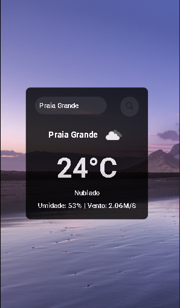

# ⛅ Aplicação de Previsão do Tempo

Uma simples aplicação que permite aos usuários obter a previsão do tempo para uma cidade específica usando a API OpenWeatherMap.

## 👀 Visão Geral

Esta aplicação foi desenvolvida para permitir que os usuários obtenham informações sobre o clima de uma cidade específica. A aplicação consome a API OpenWeatherMap e exibe dados como temperatura, descrição do clima e umidade.

## 📱 Funcionalidades

- Pesquisa por cidade para obter a previsão do tempo atual.
- Exibição da temperatura em graus Celsius.
- Exibição de uma descrição do clima.
- Exibição da umidade relativa do ar.

## 🌐 Tecnologias Utilizadas 
 - React
 - Styled Components

 ## 🤵 Api Utilizada
 - OpenWeatherMap

 ## 🧠 Autor 

 Ricardo Malta 
 Email: Ricardo.Malta@gmail.com

